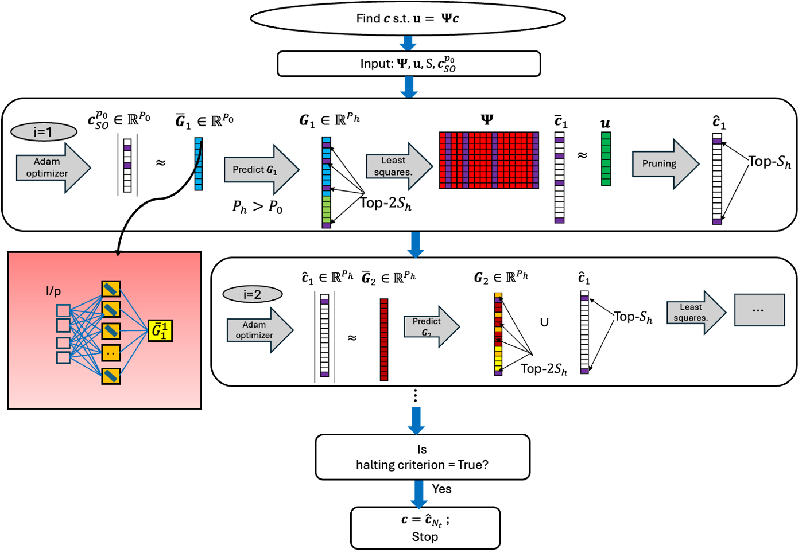
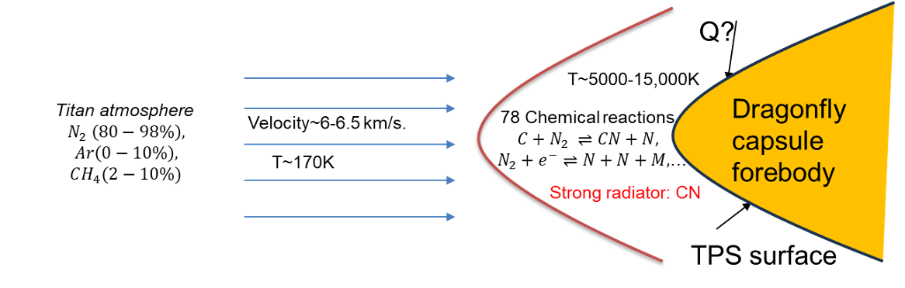
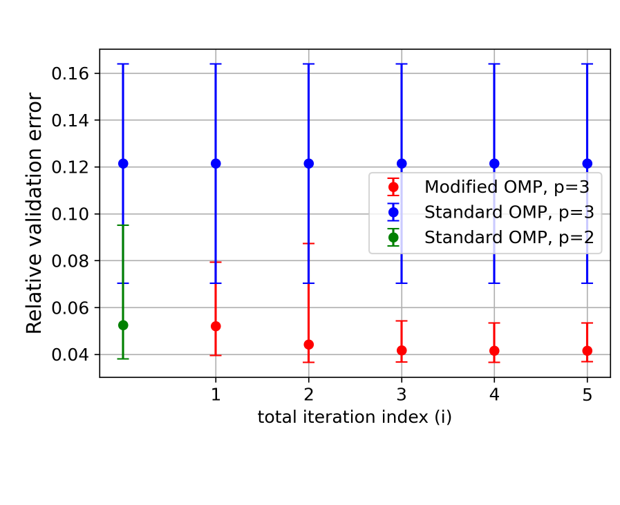

This repository contains the implementation of a deep learning-based algorithm developed for my master's thesis, titled "Neural Networks Based Algorithm for Polynomial Chaos Expansions." The core algorithm, known as the "Modified Orthogonal Matching Pursuit (OMP)," is designed to enhance the efficiency of Polynomial Chaos Expansions (PCEs). This method has practical applications in the context of NASA's space missions, providing robust solutions for uncertainty quantification in critical aerospace systems.

# Neural Network-Based Algorithm for Polynomial Chaos Expansions

## Overview

This repository contains the implementation of a **deep learning-based algorithm** developed for my master's thesis, titled **"Neural Networks Based Algorithm for Polynomial Chaos Expansions."** The core algorithm, known as the **"Modified Orthogonal Matching Pursuit (OMP),"** is designed to enhance the efficiency of **Polynomial Chaos Expansions (PCEs).** 

This innovative approach addresses challenges in **uncertainty quantification** for high-dimensional systems and has practical applications in the context of **NASA's space missions**, providing robust solutions for uncertainty quantification in critical aerospace systems.

---

## Key Applications

### NASA's ACCESS Project

The **ACCESS project** aims to quantify the reliability of spacecraft entry systems under extreme conditions. One of its most exciting applications is the **Dragonfly mission**, scheduled to launch in 2028. Dragonfly is a rotorcraft lander designed to explore **Titan**, a moon of Saturn, investigating potential alien habitability and analyzing its surface composition.

#### Use Cases:
- **21-Dimensional and 78-Dimensional Titan Chemistry Problems**: Focused on predicting **radiative heating** on Dragonfly's **thermal protection system (TPS)** during atmospheric entry.
- **20-Dimensional Heat-Driven Square Cavity Problem**: Demonstrates the MO algorithm's superior performance in sensitivity analysis and uncertainty reduction.

---

## Challenges Addressed

- **Extreme Atmospheric Conditions**: During atmospheric entry, spacecraft encounter extreme temperatures, triggering complex chemical reactions involving 78 chemical species, which significantly affect **radiative heating**.
- **Computational Inefficiency**: Traditional methods like **Orthogonal Matching Pursuit (OMP)** struggle to handle the computational demands of high-dimensional systems.

---

## How the MO Algorithm Solves These Challenges

The **Modified Orthogonal Matching Pursuit (MO)** algorithm, integrated with **neural networks**, addresses these challenges by:

1. **Efficient Sensitivity Analysis**:
   - Identifying key random parameters that significantly impact uncertainty in radiative heat flux.
2. **PCE-Based Sobol Indices**:
   - Using these indices to quantify and prioritize the impact of various parameters.
3. **Enhanced Accuracy and Speed**:
   - Achieving faster and more precise results compared to standard OMP.

---

## Results and Performance

### Workflow Diagram
The following diagram illustrates the complete workflow of the **Modified Orthogonal Matching Pursuit (MO)** algorithm:

---

### Key Results

#### Radiative Heating During Titan Atmospheric Entry
The Dragonfly capsule forebody encounters extreme conditions due to **shock layer radiation** during atmospheric entry. The MO algorithm improves the prediction of these thermal loads, critical for the **thermal protection system (TPS).**

#### Validation Error Comparisons
The MO algorithm consistently demonstrates **superior accuracy and efficiency** in predicting uncertainty compared to standard OMP, as shown below:

---

## Conclusion

The **Modified Orthogonal Matching Pursuit (MO)** algorithm offers a robust solution for **high-dimensional uncertainty quantification**, particularly in critical aerospace applications like NASA’s **Dragonfly mission.** By leveraging **neural networks**, this approach significantly reduces uncertainties in radiative heating predictions, improving the reliability and design of thermal protection systems.

---

Feel free to let me know if you'd like further refinements or additional sections for your README!

Run the following main script to execute the MO algorithm: "no_ray/scripts/cosamp_GenMod_nu_4_pcklec_v2.py".

